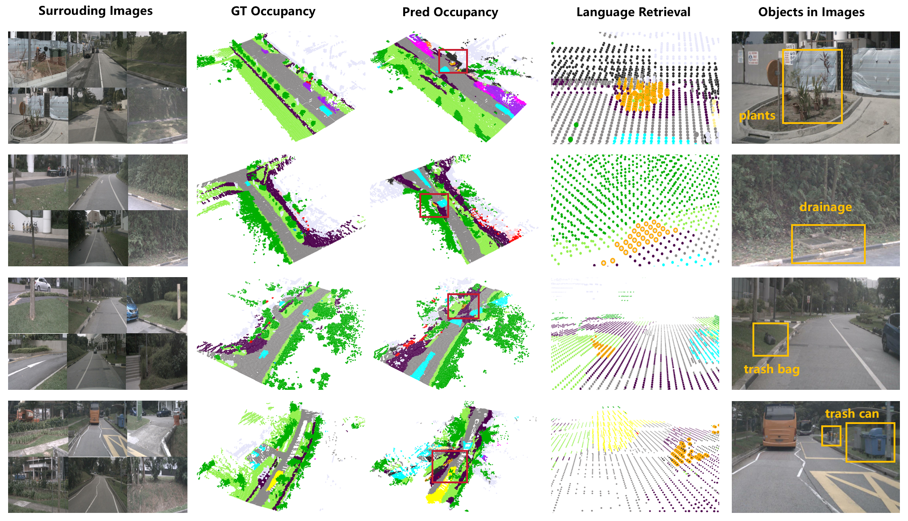

# VEON

## Introduction

This is the official implementation of [VEON (ECCV2024)](https://arxiv.org/pdf/2407.12294).

This repo includes the reproduced version of VEON, and its extended journal variant VEON*. 
The models learn **V**ocabulary-**E**nhanced 3D representation for Open-vocabulary **O**ccupancy Predictio**N** in the autonomous driving scenario. 



**The recipe of VEON** is assembling and adapting both a depth foundation model and a vision-language foundation model for 3D open-vocabulary occupancy. Please refer to [our paper](https://arxiv.org/pdf/2407.12294) for model details. 

## Get Started

Suppose the VEON codebase path is `${VEON_HOME}`. Then, follow the subsequent procedures. 

### Step 1: Prepare Environment

Prepare the base environments (BEVDet & SAN & Depth). 


**Step 1.1 BEVDet Environment** 

Please prepare the environment as that in [BEVDet](https://github.com/HuangJunJie2017/BEVDet).
VEON directly adopts the BEVDet framework (v2.1) for development. 


**Step 1.2 SAN Environment** 

Please prepare the environment as that in [SAN](https://github.com/MendelXu/SAN). 
VEON integrates SAN into the BEVDet framework for open-vocabulary recognition. 

Then, download the pretrained SAN checkpoints ([san_vit_b_16.pth](https://huggingface.co/Mendel192/san/resolve/main/san_vit_b_16.pth) and [san_vit_large_14.pth](https://huggingface.co/Mendel192/san/resolve/main/san_vit_large_14.pth)) into folder `${VEON_HOME}/ckpts/clipsan`. Then, run the following script to reformat them. 
```shell script
cd ${VEON_HOME}
python tools/misc/process_san_pth.py
```
The reformatted checkpoints are named `SAN_ViT-B.pth` and `SAN_ViT-L.pth`, also placed in folder `${VEON_HOME}/ckpts/clipsan`. The path and names of these checkpoints can be revised if you are familiar with the config files. 

**Note 1:** For those having network problem for automatically downloading openai CLIP backbones ([ViT-B-16.pt](https://openaipublic.azureedge.net/clip/models/5806e77cd80f8b59890b7e101eabd078d9fb84e6937f9e85e4ecb61988df416f/ViT-B-16.pt) and [ViT-L-14-336px.pt](https://openaipublic.azureedge.net/clip/models/3035c92b350959924f9f00213499208652fc7ea050643e8b385c2dac08641f02/ViT-L-14-336px.pt)) in function `open_clip.create_model_and_transforms()`, you may need to manually download the pretrained weights, and load them offline from the disk.  

**Note 2:**  Environments of SAN and BEVDet are basically compatible with each other, 
but you may need to install detectron2 with [detectron2-xyz](https://github.com/MaureenZOU/detectron2-xyz) for compatibility in certain Python versions (e.g., Python 3.7). 


**Step 1.3 Depth Environment** 

Prepare the depth environments. There exists two branches that can be conducted according to the depth foundation model you leverage, including Branch 1.3.1 for ZoeDepth, and Branch 1.3.2 for DepthAnythingV2. 

In fact, we use ZoeDepth variants for most experiments in our paper, but DepthAnythingV2 variants are often more stable and well-performing. **Thus, we strongly recommend using the DepthAnythingV2 variants.**


**Branch 1.3.1 MiDaS Environment** 

If you adopt **MiDaS + ZoeDepth** as the depth foundation model, please prepare the environment as that in [ZoeDepth](https://github.com/isl-org/ZoeDepth).

Then, download the pretrained ZoeDepth-NK model ([ZoeD_M12_NK.pt](https://github.com/isl-org/ZoeDepth/releases/download/v1.0/ZoeD_M12_NK.pt)) and place it into the folder `${VEON_HOME}/ckpts/zoedepth`. 
Run the following script to reformat it. 
```shell script
cd ${VEON_HOME}
python tools/misc/process_zoe_pth.py
```
The reformatted checkpoint is named `ZoeD_M12_NK_p.pt` and also placed in folder `${VEON_HOME}/ckpts/zoedepth`. 


**Branch 1.3.2 DepthAnythingV2 Environment** 

If you adopt **DepthAnythingV2** as the depth foundation model, please prepare the environment as that in [Depth-Anthing-V2/metric](https://github.com/DepthAnything/Depth-Anything-V2/tree/main/metric_depth).

Then, download the pretrained DA-V2 models (outdoor metric models including [depth_anything_v2_metric_vkitti_vitb.pth](https://huggingface.co/depth-anything/Depth-Anything-V2-Metric-VKITTI-Base/resolve/main/depth_anything_v2_metric_vkitti_vitb.pth?download=true) and [depth_anything_v2_metric_vkitti_vitl.pth](https://huggingface.co/depth-anything/Depth-Anything-V2-Metric-VKITTI-Large/resolve/main/depth_anything_v2_metric_vkitti_vitl.pth?download=true)) and place them into the folder `${VEON_HOME}/ckpts/depthanythingv2`. 


### Step 2: Prepare nuScenes Dataset

Prepare the nuScenes dataset folder as introduced in [nuscenes_det.md](./docs/en/datasets/nuscenes_det.md) and create the pkl files for BEVDet by running the following script.
```shell script
cd ${VEON_HOME}
python tools/create_data_bevdet.py
```

Please refer to issues of [BEVDet](https://github.com/HuangJunJie2017/BEVDet) if you are faced with any problems on nuScenes. 

### Step 3: Prepare Task Materials

This repository supports both Occ3D-nuScenes close-set occupancy dataset and POP-3D language-driven retrieval benchmark. 

**Step 3.1 Occ3D-nuScenes Dataset** 

For the close-set Occ3D-nuScenes occupancy prediction task, download (only) the 'gts' from 
[CVPR2023-3D-Occupancy-Prediction](https://github.com/CVPR2023-3D-Occupancy-Prediction/CVPR2023-3D-Occupancy-Prediction) 
and arrange the nuScenes dataset folder `${VEON_HOME}/data/nuscenes` as:
```shell script
└── data
      └── nuscenes
          ├── v1.0-trainval (existing)
          ├── sweeps  (existing)
          ├── samples (existing)
          └── gts (new)
```

**Step 3.2 POP-3D Retrieval Benchmark** 

For the language-driven object retrieval task, please download the materials as introducted in [POP-3D](https://github.com/vobecant/POP3D). The corresponding downloading script is [download_retrieval_benchmark.sh](https://github.com/vobecant/POP3D/blob/main/scripts/download_retrieval_benchmark.sh). After downloading, place the downloaded materials in folder `${VEON_HOME}/data/nuscenes/retrieval_benchmark/`. The folder structure is:

```shell script
└── data
      └── nuscenes
            └── retrieval_benchmark
                    ├── annotations
                    ├── matching_points
                    ├── retrieval_anns_all.csv
                    ├── retrieval_anns_eval.csv
                    ├── retrieval_anns_test.csv
                    ├── retrieval_anns_train.csv
                    └── retrieval_anns_val.csv
```

### Step 4: Check the Folder Structure

First, the `${VEON_HOME}/ckpts` folder should have the following structure before training:

```shell script
├── clipsan (necessary)
│     ├── SAN_ViT-B.pth
│     └── SAN_ViT-L.pth
├── depth_pretrain (empty)
├── depthanythingv2 (branch 1.3.1)
│     ├── depth_anything_v2_metric_vkitti_vitb.pth
│     └── depth_anything_v2_metric_vkitti_vitl.pth
└── zoedepth (branch 1.3.2)
      └── ZoeD_M12_NK_p.pt  
```

Second, the `${VEON_HOME}/data/nuscenes` folder should be organized as follows:
```shell script
└── data
    └── nuscenes
        ├── bevdetv2-nuscenes_infos_train.pkl
        ├── bevdetv2-nuscenes_infos_val.pkl
        ├── gts
        ├── lidarseg
        ├── maps
        ├── retrieval_benchmark (optional)
        ├── samples
        ├── sweeps
        ├── v1.0-test
        └── v1.0-trainval
```
Not all components from the nuScenes dataset are necessary, but the above folder structure is OK. 

## Training and Testing

Now we introduce how to train and test the VEON models.
The training stage can be divided into two stages, including Depth Pretraining (Stage 1), and Occupancy Prediction (Stage 2). 

By default, we use 8 NVIDIA V100 GPUs with 32G memory each. 

### Training Stage 1: Depth Pretraining

For adapting the depth foundation model, you should run the following script. We recommend using the DepthAnythingV2 variants instead of the MiDaS variants, but we first take the ZoeDepth variants as an example. 
```shell script
# Branch 1.3.1: MiDaS + ZoeDepth variant
# Script format: bash ./tools/dist_train.sh $config $num_gpu
cd ${VEON_HOME}
bash tools/dist_train.sh configs/veon/veon-pretrain-zoedepth.py 8
```
The outputting checkpoints are in folder `${VEON_HOME}/work_dirs/veon-pretrain-zoedepth/`. 
Before starting training stage 2, you should: (1) select one checkpoint (e.g., `epoch_48.pth`); (2) place it in `${VEON_HOME}/ckpts/depth_pretrain`; and (3) rename the checkpoint as `zoedepth_pretrain.pth`. **Note:** The file names of the adapted depth models can be revised in the config files of stage 2. 


Similarly, for the DepthAnythingV2 variants, the training script is:
```shell script
# Branch 1.3.2: Depth-Anything-V2 variant
cd ${VEON_HOME}
bash tools/dist_train.sh configs/veon/veon-pretrain-depthanythingv2.py 8
```
Before starting training stage 2, you should also select one checkpoint (e.g., `epoch_48.pth`), place it in `${VEON_HOME}/ckpts/depth_pretrain/`, and rename it as `depthanythingv2_pretrain_large.pth`. 


### Training Stage 2: Occupancy Prediction

After obtaining the finetuned depth estimator, we can start training stage 2 by the following script. We recommend using the DepthAnythingV2 variants instead of the MiDaS variants, but we first take the ZoeDepth variants as example.
```shell script
cd ${VEON_HOME}
bash tools/dist_train.sh configs/veon/veon-temporal-base-512x1408-zoe-nodepthcache.py 8
```
After training stage 2, all resulting VEON checkpoints will be stored in `${VEON_HOME}/work_dirs/veon-temporal-base-512x1408-zoe-nodepthcache/`. 


Similarly, for the DepthAnythingV2 variant, you can run the script as:
```shell script
cd ${VEON_HOME}
bash tools/dist_train.sh configs/veon/veon-temporal-base-512x1408-dav2-nodepthcache.py 8
```
The resulting VEON checkpoints will be stored in `${VEON_HOME}/work_dirs/veon-temporal-base-512x1408-dav2-nodepthcache/`. 


### Testing on Specific Tasks

After training stage 2, you can test the checkpoints stored in folder `${VEON_HOME}/work_dirs/` on specific tasks. 

**Testing Mode 1: Occ3D-nuScenes Dataset** 

To test and eval a single checkpoint (e.g. `epoch_10.pth`) on Occ3D-nuScenes, you can run the following script:
```shell script
# Testing only epoch_10.pth on Occ3D-nuScenes Dataset
# Script format: ./tools/dist_test.sh $config $checkpoint $num_gpu --eval $metric
cd ${VEON_HOME}
bash ./tools/dist_test.sh configs/veon/veon-temporal-base-512x1408-zoe-nodepthcache.py work_dirs/veon-temporal-base-512x1408-zoe-nodepthcache/epoch_10.pth 8 --eval bbox
```
However, **we strongly recommend testing all the resulting checkpoints within a certain epoch interval**, e.g. epoch 5 to epoch 15. That useful script can be written as follows:
```shell script
# Testing all checkpoints from epoch 5 to epoch 15 on Occ3D-nuScenes Dataset
# Script format: ./tools/dist_test_all.sh $config $checkpoint_folder $num_gpu $start_epoch $end_epoch --eval $metric
cd ${VEON_HOME}
bash ./tools/dist_test_all.sh configs/veon/veon-temporal-base-512x1408-zoe-nodepthcache.py work_dirs/veon-temporal-base-512x1408-zoe-nodepthcache 8 5 15 --eval bbox
```

**Note:** The corresponding config files for DepthAnythingV2 variants are also provided with `-dav2`. Again, we recommend using the DepthAnythingV2 variants instead of the MiDaS variants. 

**Testing Mode 2: POP-3D Retrieval Benchmark**

You can simply change the config file to eval a single checkpoint on POP-3D retreival benchmark. Here, **the config file is different, but the checkpoint is kept the same.**
```shell script
# Testing only epoch_10.pth on POP-3D Retrieval Benchmark
cd ${VEON_HOME}
bash ./tools/dist_test.sh configs/veon/veon-temporal-base-512x1408-zoe-retrieval.py work_dirs/veon-temporal-base-512x1408-zoe-nodepthcache/epoch_10.pth 8 --eval bbox
```

**Note:** The corresponding config files for DepthAnythingV2 variants are also provided with `-dav2`. 

## Very Useful Tricks

### Depth Cache Mechanism

In training stage 2, as the depth estimator is frozen, we can cache the predicted depth on the whole training set, and thereby accelerate the training process. 

Take the MiDaS + ZoeDepth version as an example. After obtaining the finetuned depth checkpoint (e.g. `{VEON_HOME}/ckpts/depth_pretrain/zoedepth_pretrain.pth`), you can run the following script for **only one complete epoch**, to cache all predicted depth maps on disk. Around 120G free disk space is required. 
```shell script
cd ${VEON_HOME}
bash tools/dist_train.sh configs/veon/veon-depthcache-zoedepth.py 8
```

After one epoch, all depth maps will be stored in folder `{VEON_HOME}/data/nuscenes/depth_cache/depth/`. Then, you can run training stage 2 with the following script. This would save not only training time but also GPU memory. 
```shell script
cd ${VEON_HOME}
bash tools/dist_train.sh configs/veon/veon-temporal-base-512x1408-zoe-withdepthcache.py 8
```

**Note:** The corresponding config files for DepthAnythingV2 variants are also provided, and the depth cache folder is `{VEON_HOME}/data/nuscenes/depth_cache/depth_dav2/`.

### Temporal Occupancy Prediction

In the journal version of VEON, we integrate surrounding images from multiple frames to exploit the rich temporal information. In fact, you can revise the config files by only one line to run the VEON-T{X} variants. 

Take the VEON-L-T{X} variants as an example. You can find the config file, e.g. `./configs/veon/veon-temporal-base-512x1408-zoe-nodepthcache.py`, and revise the following line:
```python
# Original code: num_temporal = 1
num_temporal = 2 # 1, 2, 3, 4 are all ok for V100
```
This would support training and testing VEON-T2 with 2-frame inputs. The training and testing scripts are kept the same. 

**Note:** We strongly recommend using the depth cache mechanism when `num_temporal > 2`, or the ``GPU out of memory'' error would occur on NVIDIA V100 GPUs.  

## Acknowledgement

This repository refers to multiple great open-sourced code bases. Thanks for their great contribution to the community. 

- [open-mmlab](https://github.com/open-mmlab)
- [BEVDet](https://github.com/HuangJunJie2017/BEVDet)
- [POP3D](https://github.com/vobecant/POP3D)
- [Depth-Anything-V2](https://github.com/DepthAnything/Depth-Anything-V2)
- [CVPR2023-3D-Occupancy-Prediction](https://github.com/CVPR2023-3D-Occupancy-Prediction/CVPR2023-3D-Occupancy-Prediction)
- [ZoeDepth](https://github.com/isl-org/ZoeDepth)

## Bibtex

If this work is helpful for your research, please consider citing the following BibTeX entry.

```bibtex
@inproceedings{eccv24-veon,
	title={VEON: Vocabulary-Enhanced Occupancy Prediction},
	author={Zheng, Jilai and Tang, Pin and Wang, Zhongdao and Wang, Guoqing and Ren, Xiangxuan and Feng, Bailan and Ma, Chao},
	booktitle={ECCV},
	year={2024},
}
```
